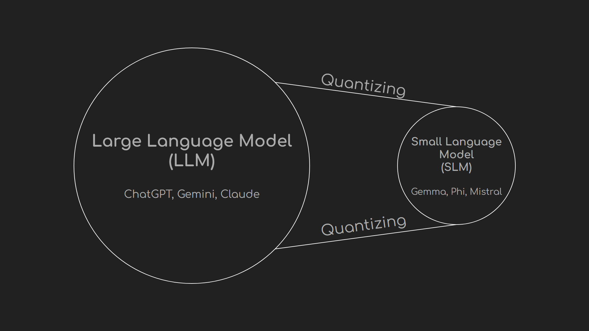

# Experimenting Phi3.5 with JavaScript and Ollama on Local Device

Created by Charunthon Limseelo. Supervised by Microsoft Thailand

Hi everyone, my name is Boat Charunthon. Welcome to my repository on experimenting Phi3.5 locally with JavaScript and Ollama. In this repository, I will guide you through all installation for running AI on your local device with no internet connection at all.

## What do you need to know about Phi3.5

Phi-3.5-mini is a lightweight, state-of-the-art open model built upon datasets used for Phi-3 - synthetic data and filtered publicly available websites - with a focus on very high-quality, reasoning dense data. The model belongs to the Phi-3 model family and supports 128K token context length. The model underwent a rigorous enhancement process, incorporating both supervised fine-tuning, proximal policy optimization, and direct preference optimization to ensure precise instruction adherence and robust safety measures.

🏡 [**Phi-3 Portal**](https://azure.microsoft.com/en-us/products/phi-3)

📰 [**Phi-3 Microsoft Blog**](https://aka.ms/phi3.5-techblog)

📖 [**Phi-3 Technical Report**](https://arxiv.org/abs/2404.14219)

👩‍🍳 [**Phi-3 Cookbook**](https://github.com/microsoft/Phi-3CookBook)

🖥️ [**Try It**](https://aka.ms/try-phi3.5mini)

## Installation Prerequisite

- Visual Studio Code (VSCode):  download it from [https://visualstudio.microsoft.com/downloads/](https://visualstudio.microsoft.com/downloads/) and normally installing it as usual. Make sure you download the latest updated version from the website. Along with installing JavaScript Essential Extension Package to get full experiences on coding JavaScript.
- Bun: Installing Bun, the “currently fastest” JavaScript runtime, by using PowerShell or Command Prompt by running the command below. If you are using the different operating system from mine, please visit [https://bun.sh/docs/installation](https://bun.sh/docs/installation) for looking up for your operating system.

```powershell
powershell -c "irm bun.sh/install.ps1|iex"
```

- Ollama: Visit [https://ollama.com/](https://ollama.com/) for installing Ollama in your operating system. If you need to run on the shell, please run it. Ollama is an application that stores AI models in your device. But kindly remind you guys that I prefer to run with ‘small language models’ only for fast running performance and due to the insufficient resource on running large language models. If you want to run LLMs, please by a high specification device to run.
- Phi3.5 on ollama by running in your shell with the command as below.

```powershell
ollama run phi3.5
```

## Get to know more about Small Language Models



Small language model is the small version of large language model that really easy to contain on your local devices. The technique of minizing the bit size of large language model is called ‘quantization’ which changing the bit size of the dataset to be small, yet changing to the model file called ‘.gguf’ for loading on your device. However, running small language models isn’t powerful much like large language models, but if you try to finetune or run with RAG (Retrieval Augmented Generation), you may get more accuracy and more efficient than LLMs, even on lower power consumption, reduce carbon emission, yet reduce your cost on paying GPT services.

## To run this repository:

I would like to recommend you guys that you might need to folk or download this git repository from me, not push into my master/main channel without my permission. If you want to make some changes on my coding, please make a request first. 

(I will be writing this README for more information)
